# AutoApplyJobs — System Architecture & Design Specification

> **Document Type:** System Architecture Specification  
> **Repository:** `d:\Coding\repo\AutoApplyJobs`  
> **Target Release:** End-to-End Autonomous AI Job Application Agent  

---

## 1. System Overview

AutoApplyJobs is an autonomous, local-first job application system. It discovers jobs across multiple sources, deterministically evaluates match relevance, prepares tailored application materials, fills portal and external ATS forms, verifies submission evidence, and maintains a strict audit trail.

```mermaid
graph TD
    subgraph Frontend_Layer ["Frontend Layer (React + Vite)"]
        UI_Dash["Dashboard & Metrics"]
        UI_Control["Bot Controls (Start/Pause/Stop)"]
        UI_Table["Application Tracker & History"]
        UI_Intervention["Human Intervention Center"]
        UI_Vault["Candidate QA Vault Editor"]
        UI_Logs["Live Log Stream (WebSocket)"]
    end

    subgraph API_Layer ["API & Communication Layer (FastAPI)"]
        API_Bot["/api/bot (Lifecycle Controls)"]
        API_Jobs["/api/jobs (History & Export)"]
        API_Resume["/api/resume (Upload & Vault)"]
        WS_Logs["/ws/logs (Real-Time Broadcaster)"]
    end

    subgraph Orchestration_Layer ["Central Orchestrator & State Machine"]
        Orchestrator["Application Orchestrator"]
        StateMachine["Thread-Safe State Machine"]
        Scheduler["Background Cron Scheduler"]
    end

    subgraph Intelligence_Layer ["Intelligence & Evaluation Layer"]
        MatchScorer["Deterministic MatchScorer (60/20/10/10)"]
        QualityScorer["Job Quality & Risk Scorer"]
        ResumeTailorer["ReportLab AI Resume Tailorer"]
        QAVault["Smart ATS QA Vault Service"]
        LLMClient["Unified AI Service (Ollama / Gemini / Cloud)"]
    end

    subgraph Discovery_Layer ["Hybrid Job Discovery Engine"]
        FastScraper["Fast HTTP Scraper (JobSpy / Guest API)"]
        BrowserScraper["Playwright Discovery (Naukri / LinkedIn / Indeed)"]
        DedupEngine["URL & Semantic Fingerprint Deduplication"]
    end

    subgraph Execution_Layer ["Universal Application Adapters"]
        NaukriAdapter["Naukri Quick Apply Adapter"]
        LinkedInAdapter["LinkedIn Easy Apply Adapter"]
        IndeedAdapter["Indeed Apply Adapter"]
        GreenhouseAdapter["Greenhouse ATS Adapter"]
        LeverAdapter["Lever ATS Adapter"]
        OutreachService["Recruiter SMTP Email & WhatsApp Outreach"]
    end

    subgraph Persistence_Layer ["Storage & Persistence"]
        DB["SQLite Database (Primary State)"]
        Excel["openpyxl Excel Tracker (Export & Audit)"]
        Storage["Versioned Resumes & Screenshots"]
    end

    UI_Control --> API_Bot
    UI_Table --> API_Jobs
    UI_Vault --> API_Resume
    WS_Logs --> UI_Logs

    API_Bot --> Orchestrator
    API_Resume --> QAVault
    Scheduler --> Orchestrator

    Orchestrator --> Discovery_Layer
    Discovery_Layer --> DedupEngine
    DedupEngine --> MatchScorer
    MatchScorer --> QualityScorer
    
    QualityScorer -->|"Eligible Job"| Orchestrator
    Orchestrator --> ResumeTailorer
    Orchestrator --> Execution_Layer
    Execution_Layer --> QAVault
    Execution_Layer --> LLMClient

    Execution_Layer -->|"Submission Verified"| Persistence_Layer
    Execution_Layer -->|"External Portal (Unfillable) + Recruiter Found"| OutreachService
    Execution_Layer -->|"CAPTCHA / 2FA / Unknown Question"| UI_Intervention
    
    Persistence_Layer --> DB
    DB --> Excel
```



---

## 2. Core Architectural Components

### 2.1 Central Application Orchestrator (`orchestrator.py`)
The orchestrator is the single authority controlling the application lifecycle. Platform-specific code is strictly delegated to adapters, preventing vendor-lock and fragmented logic.

#### Job Lifecycle State Machine:
```
DISCOVERED
   │
   ▼
ANALYZED ──(Low Match / Risk)──► SKIPPED (with ReasonCode)
   │
   ▼
ELIGIBLE
   │
   ▼
PREPARING (AI Resume Tailored & QA Vault Answers Mapped)
   │
   ▼
APPLYING (Adapter Form Filling)
   │
   ├──(CAPTCHA / 2FA / Ambiguous)──► AWAITING_USER (Intervention Center)
   │                                     │
   │                                (User Resumes)
   │                                     │
   ▼                                     ▼
SUBMITTING ─────────────────────► VERIFYING
                                         │
                 ┌───────────────────────┴───────────────────────┐
                 ▼                                               ▼
         SUBMISSION_VERIFIED                             SUBMISSION_UNVERIFIED
                 │                                               │
                 ▼                                               ▼
             SUCCESS                                       MANUAL_REVIEW
```

### 2.2 Hybrid Job Discovery Engine
To avoid browser overhead during bulk searches:
1. **Fast Discovery (HTTP-first)**: `python-jobspy` concurrently polls LinkedIn, Indeed, Glassdoor, and ZipRecruiter public endpoints for target keywords and locations.
2. **Standardization**: Discovered listings are normalized into a uniform `DiscoveredJob` schema.
3. **Deduplication Gate**: `compute_job_fingerprint` checks:
   - Canonical URL against processed URL sets.
   - Normalized `(company, title, location)` hash against existing records.
4. **Pre-Apply Scoring**: `MatchScorer` evaluates jobs in-memory. Only jobs with `score >= min_threshold` are queued for browser application.

### 2.3 Universal Application Adapter System
Every adapter implements the `ApplicationAdapter` abstract base class:

```python
class ApplicationAdapter(ABC):
    @abstractmethod
    async def can_handle(self, url: str, page_content: str) -> bool:
        """Determines if this adapter supports the target URL or DOM."""
        pass

    @abstractmethod
    async def authenticate(self, page: Page) -> bool:
        """Verifies session or executes authenticated login."""
        pass

    @abstractmethod
    async def fill_form(self, page: Page, profile: ResumeProfile, vault: QAVault) -> bool:
        """Fills form fields using Vault lookup first, LLM inference second."""
        pass

    @abstractmethod
    async def submit(self, page: Page, dry_run: bool = False) -> bool:
        """Executes form submission or stops if dry_run is enabled."""
        pass

    @abstractmethod
    async def verify_submission(self, page: Page) -> VerificationResult:
        """Inspects post-submit confirmation indicators."""
        pass
```

### 2.4 Candidate QA Vault & ATS Memory
To eliminate form rejections and LLM hallucinations:
* **Level 1 — Deterministic Vault Match**: Matches field labels (aria-label, placeholder, associated `<label>`, element name) against `VAULT_FIELD_MAP` (e.g. "notice period", "expected ctc", "work authorization").
* **Level 2 — Structured Profile Attributes**: Fallback to profile education, skills, and work history.
* **Level 3 — Grounded AI Generation**: For open-ended questions (e.g., "Why do you want to work here?"), the LLM generates a 2-3 sentence answer strictly bounded by the candidate's verified achievements.
* **Level 4 — Human Intervention**: If an unknown mandatory question cannot be grounded, pause and dispatch to `InterventionCenter`.

### 2.5 Recruiter Outreach Subsystem
When a high-match job redirects to an unfillable external portal or an HR email is detected:
* Extracts verified contact details via regex patterns (`extract_job_contacts`).
* Uses LLM to draft a personalized cold application email highlighting relevant candidate skills.
* Attaches the tailored PDF resume.
* In default mode, queues the email in the dashboard for 1-click user approval; if autonomous email sending is enabled by configuration, dispatches via SMTP.
* Generates pre-formatted `https://wa.me/` direct links for recruiter phone numbers.

---

## 3. Data Storage & Persistence Architecture

### Dual-Layer Storage Contract
1. **Operational Source of Truth (SQLite Database)**:
   - Atomic transactions prevent corrupted states.
   - Stores jobs, evaluations, application attempts, recruiter contacts, and intervention tickets.
2. **Reporting & User Export (`job_applications.xlsx`)**:
   - Updated asynchronously on state transitions.
   - Provides a readable, shareable tracker with color-coded status badges, clickable links, and match scores.

### Database Entity Relational Model
* `CandidateProfile`: Candidate contact details, summary, and skills.
* `QAVault`: Structured answers for notice period, CTC, visa, and relocation.
* `DiscoveredJob`: Canonical URL, platform, company, title, description, and freshness.
* `JobEvaluation`: Match score breakdown, quality score, risk flags, and eligibility verdict.
* `JobApplication`: Application lifecycle status, submission evidence, timestamp, and notes.
* `RecruiterContact`: Recruiter name, HR email, phone number, and outreach status.
* `InterventionTicket`: Reason (CAPTCHA, 2FA, unknown question), platform, and resolution state.

---

## 4. Real-Time Communication & UI State Sync

* **WebSocket Channel (`/ws/logs`)**:
  - Live log streaming with severity levels (`INFO`, `ACTION`, `WARNING`, `SUCCESS`, `ERROR`).
  - Emits JSON event payloads on state changes (e.g. `{"type": "INTERVENTION_REQUIRED", "payload": {...}}`).
* **Frontend State Management (`BotContext.jsx`)**:
  - Maintains synchronized status (`state`, `current_platform`, `applied_count`, `target_count`).
  - Automatically reconnects WebSocket on disconnect.
  - Periodic polling of `/api/jobs/history` ensures table stays up-to-date even if WebSockets are interrupted.

---

## 5. Security, Anti-Detection & Safety Boundaries

1. **Responsible Automation**:
   - Zero CAPTCHA/2FA bypasses. When challenges appear, pause cleanly and notify the user.
   - Natural human emulation: randomized typing delays (30–80ms), natural viewport sizes, and smooth scrolling.
   - Daily application caps (e.g. 25 applications/day) prevent account flagging.
2. **Credential Security**:
   - Credentials stored in `.env` or system keyring.
   - Strict log sanitization prevents passwords, tokens, and cookies from appearing in log streams or files.
3. **Submission Evidence Requirement**:
   - Never record an application as `SUCCESS` unless positive submission confirmation is verified on the page (toast, confirmation heading, reference number).
