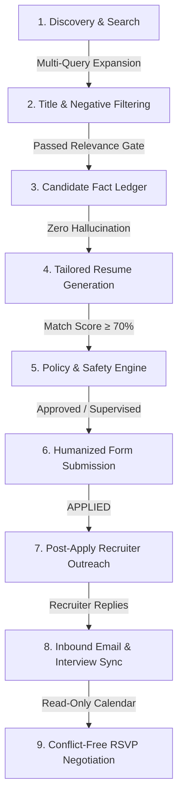

# 📖 AutoApplyJobs — Complete User Manual & Visual Guide

Welcome to **AutoApplyJobs**! This guide is written for everyday candidates who want to run the platform effortlessly, understand what happens behind the scenes during automation, and navigate every component of the Web Dashboard.

---

## 🚀 Part 1: How to Start AutoApplyJobs (3 Ways)

You have three easy ways to launch AutoApplyJobs depending on what you are doing:

### Method A: Full-Stack Interactive Launcher (Recommended for Daily Use)
1. Double-click **`start_all.bat`** in the project folder.
2. **What happens automatically**:
   - ✅ **Auto-loads AI Model**: Detects Ollama on your computer, starts the Ollama server in the background, and immediately loads your local AI model (`qwen2.5-coder:7b`) into memory so answers generate instantly.
   - ✅ **Starts Backend API**: Launches the Python FastAPI engine on `http://localhost:8000`.
   - ✅ **Starts Frontend Dashboard**: Launches the React UI and opens it in your web browser at `http://localhost:5173`.
3. Open your browser to **`http://localhost:5173`** to access your dashboard.

---

### Method B: Silent 9-to-5 Workday Mode (Zero Screen Clutter)
> *Best when you are working at your daytime job and want the bot running in the background without any visible black terminal windows or browser popups.*

1. Double-click **`run_9to5_silent.vbs`**.
2. **What happens**:
   - The bot runs completely hidden (0 console windows on screen).
   - Operates in headless mode (no browser window jumping on your screen).
   - Enforces 9-to-5 business hours (only applies Monday–Friday between 09:00 AM and 05:00 PM).
   - Writes all activity silently to `logs/9to5_daemon.log`.

---

### Method C: Workday Control Center Menu
1. Double-click **`run_9to5_background.bat`**.
2. You will see an interactive menu:
   - `[1] Start Silent 9-to-5 Runner`: Launches the invisible background worker.
   - `[2] Start Foreground Runner`: Runs with live streaming terminal logs.
   - `[3] View Watchdog Status & Recent Logs`: Displays the last 30 log lines.
   - `[4] Stop Running Watchdog & Backend Instances`: Cleanly shuts down background workers.

---

## 🤖 Part 2: What Happens During Automation (The End-to-End Lifecycle)

AutoApplyJobs is **not** a dumb form spammer. It is a full career agent that acts like a meticulous human assistant. Here is the exact journey of every job:

### 1. High-Yield Job Discovery
- The bot doesn't just search "Software Engineer". It expands your search into synonyms (e.g. *Backend Engineer, Python Developer, Distributed Systems Engineer*) and constructs platform boolean queries (`OR`, `AND`, `NOT`).
- It filters out non-relevant roles (*Internships, Unpaid, Director, Vice President*) **before** loading web pages.
- It queries **LinkedIn**, **Naukri**, **Indeed**, and external corporate portals (**Greenhouse**, **Lever**, and **Workday**).

### 2. Candidate Fact Ledger (Zero Hallucinations)
- The bot extracts verified facts from your uploaded resume (degrees, actual employers, real skills, exact years of experience).
- **The Golden Rule**: *No evidence = No claim*. The AI is strictly forbidden from inventing qualifications or inflating your experience numbers.

### 3. Tailored Resume PDF Synthesis
- For each job, the bot analyzes the job description keywords and formats a clean, professional, ATS-optimized PDF resume tailored specifically to that opening.

### 4. Humanized Form Filling (Anti-Detection)
- The bot uses `StealthDriver` with natural mouse movements (Bézier curves), human typing delays, and typo corrections.
- If a button is obscured or built in a complex iframe/Shadow DOM, the **Vision Coordinate Solver** calculates coordinates and clicks naturally.

### 5. Post-Apply Recruiter Outreach
- As soon as an application is submitted, the bot identifies the hiring team lead or recruiter.
- It drafts a polite, concise LinkedIn connection note (<300 characters) or follow-up email.
- It sends an alert to your phone via Telegram with `[Approve & Send]` and `[View Note]` buttons so you stay in control.

### 6. Recruiter Replies & Calendar Conflict Resolution
- The bot monitors your email inbox via secure IMAP.
- When an interview invitation arrives, it checks your calendar (`.ics` feed).
- It calculates conflict-free slots during normal hours that **never collide with your existing work meetings** and drafts a polite RSVP reply.

---

## 🖥️ Part 3: Dashboard Walkthrough (Exact UI Breakdown)

When you open `http://localhost:5173`, you will see a sleek, dark-mode command center. Here is the exact structure matching the actual application components:

---

### 1. Header & Navigation Bar (`Navbar.jsx`)

Located at the very top of your screen:
- **Brand Title**: `AutoApplyJobs` with an `AUTONOMOUS AI` cyan pill and subtitle *"Enterprise Agent with Local AI & Scheduler"*.
- **5 Navigation Tabs**:
  1. 📊 **Bot Dashboard**: Main workspace for configuring search, uploading resumes, watching live logs, and viewing applied jobs.
  2. 📈 **Funnel & Analytics**: Visual conversion funnel and success rates across all platforms.
  3. 🛡️ **Interventions**: The human-in-the-loop action center (shows a red badge count e.g. `[3]` when reviews, tickets, or outreach drafts need attention).
  4. 🗄️ **QA Vault**: Your personal database of interview answers (notice period, visa, salary, etc.).
  5. ⏰ **Scheduler**: Set 9-to-5 business hours, morning hunt schedule, and daily caps.
- **System Status Indicators (Top Right)**:
  - **Ollama Status Box**: Shows `Ollama: qwen2.5-coder:7b` with a green glowing pulsing dot if local AI is online (or red if offline).
  - **Bot State Badge**: Displays current engine state: `IDLE`, `RUNNING`, `PAUSED`, or `STOPPED`.

---

### 2. Status & Metrics Row (`StatusIndicator.jsx`)

Located directly below the header:
- **CAPTCHA / 2FA Action Banner**:
  - Only appears if a platform presents a bot verification puzzle or SMS OTP.
  - Displays a yellow alert banner: *"Manual User Action Required: A CAPTCHA or 2FA challenge was detected. Solve it in your browser window, then click Resume."*
  - Has a **`Resume Bot Now`** button that instantly unpauses the bot after you solve it.
- **4 Real-Time Metrics Cards**:
  1. 📨 **Total Tracked Applications**: Total lifetime jobs recorded in your database.
  2. ✅ **Submitted Successfully**: Jobs successfully applied with confirmation receipts (green).
  3. ⚠️ **Manual Review Needed**: Applications held in the review queue or requiring user answers (amber).
  4. ⚡ **Active Session Progress**: Current run progress (e.g. `4 / 25 Target`) accompanied by an animated progress bar.

---

### 3. Tab 1: Bot Dashboard View

When the **Bot Dashboard** tab is selected, the page is laid out in two upper columns plus a full-width bottom table:

#### A. Left Column — Upper Section: Resume Profile (`ResumeUploader.jsx`)
- **Upload Dropzone**: Drop your PDF or DOCX resume here. The system parses your contact details, education, work history, and skills automatically.
- **Parsed Profile Display**: Shows your Name, Email, Phone, Location, and skill tags.
- **`Edit Profile` Button**: Allows manual editing of your contact details, adding new skills, or removing outdated tags.
- **`View Full Profile Details` (Collapsible)**: Expand to inspect extracted work experience bullets, college degrees, and personal projects.

#### B. Left Column — Lower Section: Search & Bot Configuration (`BotControlPanel.jsx`)
- **Job Title / Keywords**: Target role titles (e.g. `Full Stack Developer, Python`).
- **Location**: Desired job location (e.g. `Remote`, `New York`, `Bengaluru`).
- **Experience (Years)**: Minimum experience level filter (auto-synced from your resume).
- **Job Freshness**: Dropdown filter (`Any Time`, `Last 24 Hours`, `Last 3 Days (Recommended)`, `Last 7 Days`).
- **Max Applications**: Maximum jobs to submit in this run (e.g. `25`).
- **Cooldown Between Jobs (sec)**: Jitter pause between submissions (default: `15s`) to mimic human behavior.
- **Min Match Score (%)**: Minimum threshold (default: `60%` or `70%`) for a job to be considered.
- **Match Gating Mode**:
  - `Observe`: Logs the score and persists the job, but doesn't skip it.
  - `Enforce`: Automatically skips any job scoring below your minimum match score.
- **Target Job Platforms**:
  - Checkboxes for **LinkedIn**, **Naukri**, **Indeed**, and **Dindin**.
  - Shows a green `Ready` badge if platform credentials exist in `.env`, or grey `No .env` badge.
- **Advanced Toggles**:
  - **Quick Apply Only**: Skips external multi-step redirects, focusing only on fast 1-click apply jobs.
  - **Headless Mode**: When checked, runs silently in the background without opening browser windows.
  - **Dry Run Mode**: Fills forms completely but does **NOT** click the final submit button.
- **Update Naukri Profile Headline**:
  - Enter a professional headline (e.g. `Full Stack Developer | React | Node.js | MongoDB`).
  - Click **`Save Headline`** to update your live Naukri profile using stored session cookies.
- **Control Buttons**:
  - **`Start Auto-Apply Bot`** (Green): Launches the job search and application runner.
  - **`Run Pre-flight Check`** (Blue Outline): Runs a pre-flight test verifying your browser, credentials, and network before applying.
  - **`Pause Bot`** / **`Stop Bot`**: Appear dynamically while the bot is active.

#### C. Right Column: Live Terminal Feed (`LiveLogFeed.jsx`)
- Real-time color-coded WebSocket log output:
  - 🟢 **`[INFO]`**: Standard milestones (*Navigating to LinkedIn, Job parsed, Form field filled*).
  - 🟡 **`[WARNING]`**: Non-critical warnings (*Duplicate job skipped, Daily cap reached*).
  - 🔴 **`[ERROR]`**: Issues needing attention (*Session expired, Network timeout*).
  - 🟣 **`[AI]`**: AI thought reasoning while answering questionnaire dropdowns.
- Header actions: **`Auto-Scroll` toggle** and **`Clear Logs`** trash button.

#### D. Bottom Full-Width Table: Applications Record (`JobApplicationsTable.jsx`)
- Complete historical record of every job touched:
  - **Search & Filter Bar**:
    - Search input (searches job title, company, notes, reason codes).
    - Platform filter dropdown (`All Platforms`, `LinkedIn`, `Naukri`, `Indeed`, `Dindin`).
    - Status filter dropdown (`All Statuses`, `Manual Review Queue`, `Success / Applied`, `Failed`).
    - **`Download Excel Tracking (.xlsx)`** button: Exports an Excel file formatted for your job hunt records.
  - **Table Columns**:
    1. **Timestamp**: Exact date and time processed.
    2. **Platform**: Platform badge (`LinkedIn`, `Naukri`, `Indeed`, etc.).
    3. **Job Title & Company**: Target role title, company name, and internal Job ID.
    4. **Status**: Color badge (`Applied`, `Review Needed`, `Dry Run`, `Failed`).
    5. **Match**: Semantic match score badge (`92%`, `78%`, etc.).
    6. **Quality**: ⭐ Job Quality rating percentage.
    7. **Priority**: 🔥 Application Priority rating percentage.
    8. **Recruiter / Contact**: Recruiter name and clickable HR email with a 1-click copy button.
    9. **Reason / Notes**: Reason codes, skip reasons, or verification notes.
    10. **Action / Link**:
        - For standard jobs: Click **`View ↗`** to open the real job posting, or click **`📄 Resume`** to download the tailored PDF generated for that exact role!
        - For manual review jobs: Click **`⚡ Apply Now`**, **`✓ Applied`**, or **`✕ Dismiss`**.

---

### 4. Tab 2: Funnel & Analytics (`ConversionFunnel.jsx`)
- **Conversion Funnel Visualization**:
  $$\text{Discovered} \longrightarrow \text{Eligible (Match } \ge 70\%) \longrightarrow \text{Applied} \longrightarrow \text{Interviews} \longrightarrow \text{Offers}$$
- **Key Metrics**:
  - **Interview Conversion Rate**: Percentage of applications leading to recruiter contact.
  - **ATS Compatibility Rate**: How often candidate resumes score above the 70% threshold.
  - **Platform Breakdown**: Bar charts comparing success rates between LinkedIn, Naukri, and Indeed.

---

### 5. Tab 3: Interventions (`InterventionCenter.jsx`)
This center houses 3 internal sub-tabs:
1. 📋 **Review Queue Sub-tab**:
   - Shows jobs held in Assist or Supervised mode before submission.
   - Lets you inspect the exact answers drafted by the AI.
   - Action buttons: **`Apply Now`**, **`Mark Applied`**, **`Dismiss`**.
2. 📨 **Recruiter Outreach Sub-tab**:
   - Lists drafted LinkedIn connection notes (<300 characters), cold emails, and WhatsApp messages.
   - Filter by `DRAFTED`, `SENT`, or `ALL`.
   - Action buttons: **`Send Note`**, **`Preview`**, or **`Edit`**.
3. 🧪 **Screening Sandbox Sub-tab**:
   - An interactive test bench: type any screening question (e.g. *"How many years of experience do you have with AWS?"*), select question type (`text`, `radio`, `dropdown`), and click **`Test AI Answer`**.
   - See how the AI solves it, verify the answer, and click **`Save to QA Vault`** so the answer is permanently memorized!

---

### 6. Tab 4: QA Vault (`QAVaultEditor.jsx`)
Your persistent answer database for application screening questions:
- **Work Authorization**: Legal authorization to work in the country (`Yes / No`).
- **Visa Sponsorship**: Future visa sponsorship requirement (`Yes / No`).
- **Notice Period**: Availability window (`Immediate`, `15 Days`, `1 Month`, etc.).
- **Salary Expectations**: Minimum and Target salary values (in USD or INR).
- **Custom Question & Answer Pairs**:
  - Add custom question patterns and your approved answer.
  - Delete or modify saved answers at any time.
  - Click **`Save QA Vault`** to persist changes across all platforms.

---

### 7. Tab 5: Scheduler (`SchedulerSettings.jsx`)
Manage unattended background runs:
- **Scheduler Status Box**: Displays whether the background scheduler is currently `ACTIVE` or `STOPPED`.
- **Morning Hunt Time**: Set the daily hour (`09`) and minute (`00`) for the morning application run.
- **Headline Refresh Interval**: Set how often (every `6` hours) to refresh your profile headline on job boards.
- **Daily Application Cap**: Hard safety ceiling on applications per day (default: `25`).
- **Actions**: **`Start Scheduler`**, **`Stop Scheduler`**, and **`Save Configuration`**.

---

## 📱 Part 4: Mobile Telegram Remote Control (Bonus)

If you configure Telegram in `.env`:
- When an application needs your approval, your phone buzzes with:
  - **Role & Company**
  - **Match Score**
  - Inline Buttons: `[✅ Approve & Submit]` and `[❌ Reject & Skip]`.
- Tap the button on your phone, and the bot immediately submits the application from your laptop without you having to open the web dashboard.
- Commands you can send to your bot on Telegram:
  - `/status` — Check system health.
  - `/today` — Today's application metrics.
  - `/review` — View pending applications awaiting signoff.
  - `/outreach` — View pending recruiter connection notes.
  - `/pause` / `/resume` — Pause or resume the application scheduler.

---

## 🛡️ Summary of Safety Guarantees

| Feature | How It Protects You |
|---|---|
| **Candidate Fact Ledger** | Zero hallucinations; never claims skills or years of experience you don't possess. |
| **Business Hour Guard** | Only applies between 9:00 AM and 5:00 PM on weekdays; prevents suspicious off-hours bot activity. |
| **Calendar Conflict Sync** | Cross-references your private `.ics` calendar so interview auto-replies never overlap with your daytime work meetings. |
| **Silent Runner** | 0 console windows and 0 taskbar clutter; runs invisibly while you work. |
| **Stealth Driver** | Bézier mouse movements, natural keystroke jitter, and daily application limits prevent platform detection. |
