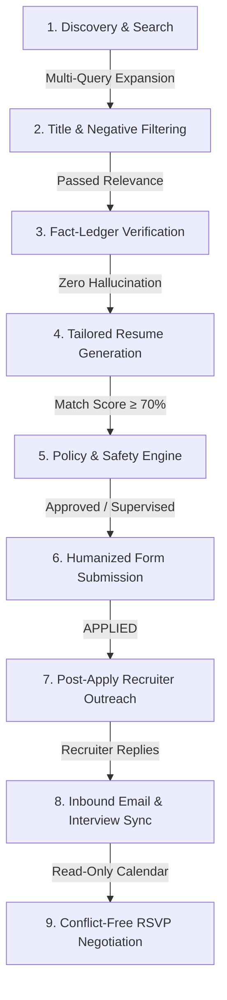

# 📖 AutoApplyJobs — Complete User Manual & Visual Guide

Welcome to **AutoApplyJobs**! This guide is written for everyday candidates who want to run the platform effortlessly, understand what happens behind the scenes during automation, and navigate every component of the Web Dashboard.

---

## 🚀 Part 1: How to Start AutoApplyJobs (3 Ways)

You have three easy ways to launch AutoApplyJobs depending on what you are doing:

### Method A: Full-Stack Interactive Launcher (Recommended for First-Time Setup)
1. Double-click **`start_all.bat`** in the project folder.
2. **What happens automatically**:
   - ✅ **Auto-loads AI Model**: Detects Ollama on your computer, starts the Ollama server in the background, and immediately loads your local AI model (`qwen2.5-coder:7b`) into memory so answers generate instantly.
   - ✅ **Starts Backend API**: Launches the Python FastAPI engine on `http://localhost:8000`.
   - ✅ **Starts Frontend Dashboard**: Launches the React UI and opens it in your web browser at `http://localhost:5173`.
3. Open your browser to **`http://localhost:5173`** to access your dashboard.

---

### Method B: Silent 9-to-5 Workday Mode (Zero Screen Clutter)
> *Best when you are working at your daytime job and want the bot running in the background without any visible black terminal windows or browser popups.*

1. Double-click **`run_9to5_silent.vbs`**.
2. **What happens**:
   - The bot runs completely hidden (0 console windows on screen).
   - Operates in headless mode (no browser window jumping on your screen).
   - Enforces 9-to-5 business hours (only applies Monday–Friday between 09:00 AM and 05:00 PM).
   - Writes all activity silently to `logs/9to5_daemon.log`.

---

### Method C: Workday Control Center Menu
1. Double-click **`run_9to5_background.bat`**.
2. You will see an interactive menu:
   - `[1] Start Silent 9-to-5 Runner`: Launches the invisible background worker.
   - `[2] Start Foreground Runner`: Runs with live streaming terminal logs.
   - `[3] View Watchdog Status & Recent Logs`: Displays the last 30 log lines.
   - `[4] Stop Running Watchdog & Backend Instances`: Cleanly shuts down background workers.

---

## 🤖 Part 2: What Happens During Automation (The End-to-End Lifecycle)

AutoApplyJobs is **not** a dumb form spammer. It is a full career agent that acts like a meticulous human assistant. Here is the exact journey of every job:

### 1. High-Yield Job Discovery
- The bot doesn't just search "Software Engineer". It expands your search into synonyms (e.g. *Backend Engineer, Python Developer, Distributed Systems Engineer*) and constructs platform boolean queries (`OR`, `AND`, `NOT`).
- It filters out non-relevant roles (*Internships, Unpaid, Director, Vice President*) **before** loading web pages.
- It queries **LinkedIn**, **Naukri**, **Indeed**, and external corporate portals (**Greenhouse**, **Lever**, and **Workday**).

### 2. Candidate Fact Ledger (Zero Hallucinations)
- The bot extracts verified facts from your uploaded resume (degrees, actual employers, real skills, exact years of experience).
- **The Golden Rule**: *No evidence = No claim*. The AI is strictly forbidden from inventing qualifications or inflating your experience numbers.

### 3. Tailored Resume PDF Synthesis
- For each job, the bot analyzes the job description keywords and formats a clean, professional, ATS-optimized PDF resume tailored specifically to that opening.

### 4. Humanized Form Filling (Anti-Detection)
- The bot uses `StealthDriver` with natural mouse movements (Bézier curves), human typing delays, and typo corrections.
- If a button is obscured or built in a complex iframe/Shadow DOM, the **Vision Coordinate Solver** calculates coordinates and clicks naturally.

### 5. Post-Apply Recruiter Outreach
- As soon as an application is submitted, the bot identifies the hiring team lead or recruiter.
- It drafts a polite, concise LinkedIn connection note (<300 characters) or follow-up email.
- It sends an alert to your phone via Telegram with `[Approve & Send]` and `[View Note]` buttons so you stay in control.

### 6. Recruiter Replies & Calendar Conflict Resolution
- The bot monitors your email inbox via secure IMAP.
- When an interview invitation arrives, it checks your calendar (`.ics` feed).
- It calculates conflict-free slots during normal hours that **never collide with your existing work meetings** and drafts a polite RSVP reply.

---

## 🖥️ Part 3: Dashboard Walkthrough (Every UI Element Explained)

When you open `http://localhost:5173`, you will see a sleek, dark-mode command center. Here is what every tab, button, and card does:

---

### 1. Top Status & Navigation Bar
- **AutoApplyJobs Logo**: Indicates the system is active.
- **5 Navigation Tabs**:
  - **Dashboard**: Main control center for starting jobs and watching live logs.
  - **Analytics**: Visual conversion funnel showing applied, reviewed, and interview stages.
  - **Action Center**: Pre-submit approval queue, manual intervention tickets, and recruiter outreach drafts. A red badge `(3)` shows items awaiting your attention.
  - **QA Vault**: Your personal database of interview answers (notice period, visa, salary, etc.).
  - **Scheduler**: Set 9-to-5 business hours, morning run time, and daily caps.
- **Top Metrics Pills**:
  - **Total Applications**: Lifetime applications submitted.
  - **Today's Applications**: Applications submitted today vs. your daily cap (e.g. `4 / 25`).
  - **Interview Stage**: Applications that have progressed to interviews.
  - **Queue Pending**: Applications awaiting pre-submit review or CAPTCHA solving.

---

### 2. Tab 1: Dashboard View

The Dashboard is divided into three sections:

#### A. Left Column — Resume Profile & Bot Controls
- **Resume Uploader Card**:
  - **Upload PDF / DOCX**: Drag-and-drop your master resume. The system automatically extracts your skills, work history, education, and contact details.
  - **Fact Ledger Verification Drawer**: Displays verified atomic facts. You can verify or edit your skills so the AI knows what is 100% true.
  - **Tailoring Templates**: Choose your preferred PDF resume visual style (Classic, Modern, Minimal).
- **Bot Control Panel Card**:
  - **Keyword Input**: e.g., `Full Stack Developer, Python, React`.
  - **Location Input**: e.g., `Remote` or `New York, NY`.
  - **Platform Checkboxes**: Select which platforms to target (`LinkedIn`, `Naukri`, `Indeed`, `Workday`, `Greenhouse`, `Lever`).
  - **Max Applications Slider**: Limits how many applications to send in one run (e.g., `10`).
  - **Autonomy Mode Selector**:
    - **Assist**: Fills out forms, pauses before submission, and waits for your approval.
    - **Supervised**: Auto-submits high-match jobs; pauses for approval on sensitive questions (salary, visa).
    - **Autonomous**: Fully automated background submission for verified-fact matches.
  - **Headless Mode Toggle**: Turn ON for silent invisible execution; turn OFF if you want to watch the Chromium browser open and type.
  - **Dry Run Toggle**: Tests discovery and form filling without actually pressing the final "Submit" button.
  - **`Start Application Run` Button**: Launches the job search and application runner.
  - **`Pause` / `Resume` / `Stop` Buttons**: Temporarily pause or terminate active browser workers.

#### B. Right Column — Live WebSocket Terminal (`LiveLogFeed`)
- Real-time color-coded terminal logs:
  - 🟢 **[INFO]**: Normal progress (job found, form page opened, field filled).
  - 🟡 **[WARNING]**: Non-critical notices (skipped duplicate job, daily cap limit).
  - 🔴 **[ERROR]**: Actionable issues (network disconnect, session expired).
  - 🟣 **[AI]**: LLM reasoning and screening question answers.
- **Clear Logs** & **Auto-Scroll** buttons.

#### C. Bottom Full-Width Table — Job Applications (`JobApplicationsTable`)
- Every job found or applied appears in this live table:
  - **Company & Job Title**: Direct link to the original job posting.
  - **Platform**: `LINKEDIN`, `NAUKRI`, `INDEED`, `WORKDAY`, `GREENHOUSE`, `LEVER`.
  - **Match Score**: 0% to 100% suitability rating.
  - **Status Badge**: `APPLIED`, `INTERVIEW_SCHEDULED`, `UNDER_REVIEW`, `REJECTED`, or `FAILED`.
  - **Applied Date**: Exact timestamp.
  - **Actions**:
    - **`Prepare Interview` Button**: Opens the **AI Mock Interview Coach** for that specific job!

---

### 3. AI Mock Interview Coach Modal (Opened from Job Table)
When you click **Prepare Interview** on any job row:
- **Company & Role Dossier**: Strategic intelligence about the employer, role responsibilities, and expected tech stack.
- **10 Tailored Technical Questions**: Deep-dive questions likely to be asked in the technical interview.
- **STAR Behavioral Stories**: Situation-Task-Action-Result talking points generated from your real resume experience.
- **Interactive Practice Studio**: Type your practice answer, and the AI evaluates your response with a 1–10 clarity score and improvement feedback.

---

### 4. Tab 2: Analytics & Conversion Funnel (`ConversionFunnel`)
- **Visual Funnel Chart**:
  - `Discovered` ➔ `Eligible (Match ≥ 70%)` ➔ `Applied` ➔ `Interview Invites` ➔ `Offers`.
- **Key Performance Indicators**:
  - **Interview Conversion Rate**: Percentage of applications resulting in interview invites.
  - **ATS Pass Rate**: Percentage of applications scoring above the 70% match threshold.
  - **Top Skills in Demand**: Most frequent keywords requested by employers.

---

### 5. Tab 3: Action Center (`InterventionCenter`)
This tab gathers everything that needs human review:
- **Pre-Submit Review Queue**:
  - Shows jobs held for approval in Assist or Supervised mode.
  - Displays the exact questionnaire answers the AI plans to submit.
  - Click **`Approve & Submit`** or **`Reject & Skip`**.
- **Manual Intervention Tickets**:
  - If a website presents a CAPTCHA or two-factor SMS OTP, an intervention ticket appears here with a direct browser link or input field.
- **Recruiter Outreach Drafts**:
  - Displays drafted LinkedIn connection messages and emails.
  - Click **`Send Note`** to dispatch or **`Edit`** to adjust the message.

---

### 6. Tab 4: QA Vault Editor (`QAVaultEditor`)
The QA Vault is your permanent answer bank for common application questions:
- **Work Authorization**: "Are you legally authorized to work in the country?" (`Yes / No`).
- **Visa Sponsorship**: "Will you now or in the future require visa sponsorship?" (`Yes / No`).
- **Notice Period**: "What is your official notice period?" (e.g. `Immediate`, `15 Days`, `1 Month`).
- **Salary Expectations**: Minimum and target salary numbers (USD / INR).
- **Custom Q&A List**: Add custom question patterns and your preferred answers so the bot never has to guess.

---

### 7. Tab 5: Scheduler Settings (`SchedulerSettings`)
Configure unattended background execution:
- **Daily Application Cap**: Maximum applications to submit per day (e.g. `20` or `25` to keep accounts safe).
- **9-to-5 Business Hours Guard**: When turned ON, the bot will automatically pause outside 9:00 AM – 5:00 PM and on weekends.
- **Morning Hunt Schedule**: Set the exact time (e.g., `09:30 AM`) for the daily autonomous application loop to run.
- **Profile Freshness Heartbeat**: Periodically updates your profile headline on job boards to keep your profile at the top of recruiter searches.

---

## 📱 Part 4: Mobile Telegram Remote Control (Bonus)

You can connect your Telegram app so you never have to check your laptop during the day:
1. When a job needs your review, your phone buzzes with:
   - **Role & Company**
   - **Match Score**
   - **Inline Buttons**: `[✅ Approve & Submit]` and `[❌ Reject & Skip]`.
2. Tap the button directly on your phone, and the bot immediately resumes and submits the application.
3. Available Telegram slash commands:
   - `/status` — Check if the bot is active.
   - `/today` — View today's application count.
   - `/review` — View pending applications.
   - `/outreach` — View pending recruiter follow-ups.
   - `/pause` / `/resume` — Pause or resume the application runner.

---

## 🛡️ Summary of Safety Guarantees

| Feature | How It Protects You |
|---|---|
| **Candidate Fact Ledger** | Zero hallucinations; never claims skills or years of experience you don't possess. |
| **Business Hour Guard** | Only applies between 9:00 AM and 5:00 PM on weekdays; prevents suspicious off-hours bot activity. |
| **Calendar Conflict Sync** | Cross-references your private `.ics` calendar so interview auto-replies never overlap with your daytime work meetings. |
| **Silent Runner** | 0 console windows and 0 taskbar clutter; runs invisibly while you work. |
| **Stealth Driver** | Bézier mouse movements, natural keystroke jitter, and daily application limits prevent platform detection. |
